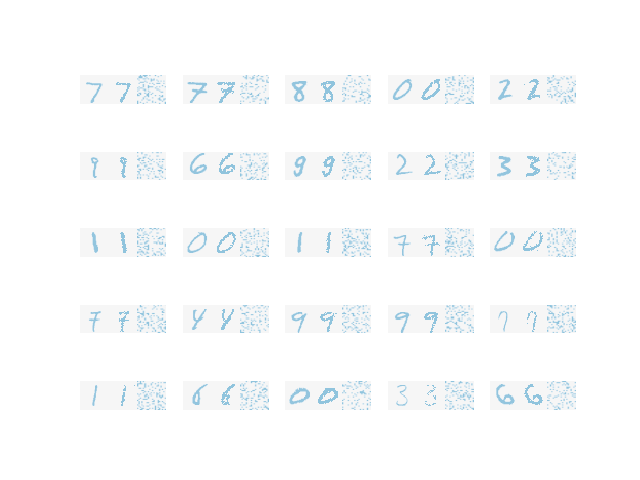

# Boltzman Machine
A Boltzmann Machine is a network of symmetrically connected, neuronlike units that make stochastic decisions about whether to be on or off. 

## Restricted Boltzman Machine(RBM)
A restricted Boltzmann machine (RBM) is a special type of a Boltzmann machine where the pair interactions are restricted to be between an observed set of units and an unobserved set of units. Restricted boltzman machine is a bipartite graph, where hidden units are connected to visible units and there are no inter connection with in the layer. 

# Requirements

## Python
Works for python3. Tested with version 3.9.5. 

### Libraries
To install all the required libraries run `pip install -r requirements.txt`

# Implementation
Boltzman machine is implemented int the notebook file and if you want the code for math behind the scenes it it in `boltzman.py`.

# Run
To test the result of the boltzman machine, run `python boltzman_test.py` and it will store the result in `output.png`

# Output

# Resources
[Restricted Boltzman Machine](https://mohitd.github.io/2017/11/25/rbms.html)  
[Wikipedia](https://en.wikipedia.org/wiki/Boltzmann_machine)  
[Introduction to RBM](https://youtu.be/Fkw0_aAtwIw)